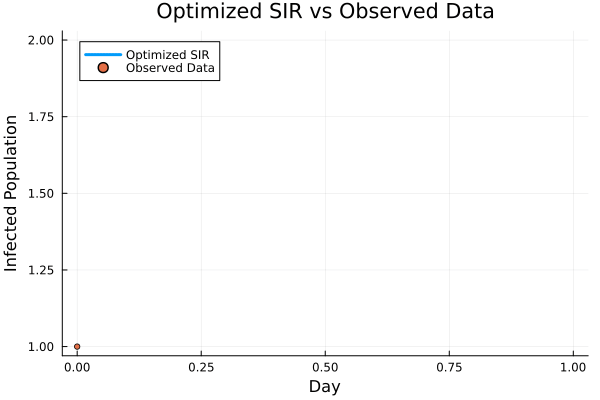
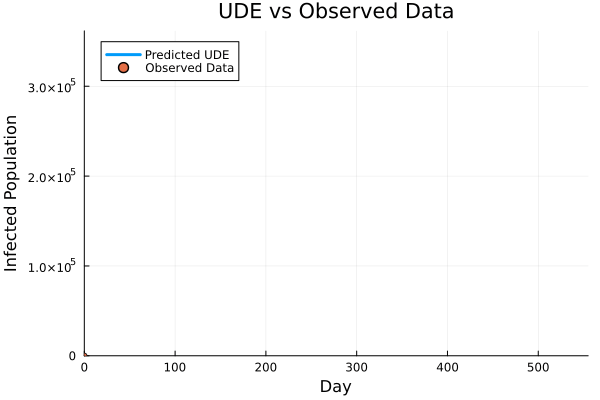

# COVID-19 Epidemic Modelling using SIR and Universal Differential Equation (UDE)

Developed a COVID-19 epidemic model using the classical SIR (Susceptible–Infected–Recovered) model and a Universal Differential Equation (UDE). The UDE combines the SIR differential equations with a neural network to learn a changing transmission rate, allowing the model to represent changes in epidemic dynamics over time.

The models were applied to COVID-19 data from Germany, and their performance was evaluated by comparing the predicted and observed infected cases.

---

## Results

### Classical SIR Model with Optimization

The classical SIR model was fitted to the observed infected cases by optimizing the transmission rate (β) and recovery rate (γ).

| Metric | Result |
|---|---:|
| Estimated β | 0.5260279217 |
| Estimated γ | 0.3959500812 |
| Final Loss | 4.486392279 × 10⁸ |
| MSE | 4.486392279 × 10⁸ |
| RMSE | 21,181.11 |
| MAE | 15,307.57 |
| R² | **0.9613** |

  

**Optimized Classical SIR Model compared with observed infected cases in Germany**

---

### UDE-SIR Model

The UDE-SIR model extends the SIR framework by incorporating a neural network into the differential equations to learn a changing transmission rate.

| Metric | Result |
|---|---:|
| Estimated β | 0.4677637765 |
| Estimated γ | 0.4253704716 |
| Loss | 6.238839655 × 10⁹ |
| MSE | 6.239202305 × 10⁹ |
| RMSE | 78,988.62 |
| MAE | 43,738.72 |
| R² | 0.4614 |

  

**UDE-SIR Model compared with observed infected cases in Germany**

---

### Model Comparison

| Model | MSE | RMSE | MAE | R² |
|---|---:|---:|---:|---:|
| Classical SIR | 4.49 × 10⁸ | 21,181.11 | 15,307.57 | **0.9613** |
| UDE-SIR | 6.24 × 10⁹ | 78,988.62 | 43,738.72 | 0.4614 |

The optimized classical SIR model achieved better performance than the UDE-SIR model for this experiment, with a higher R² and lower error values.
